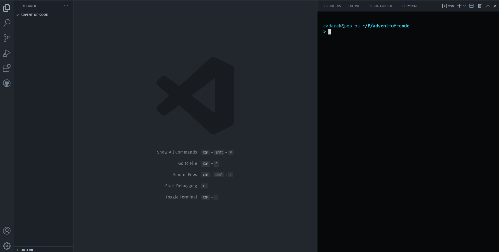

# AoC Runner

This repo contains the utility library to create and run [Advent of Code](https://adventofcode.com/2022/about) solutions.

---



## Overview

- Creates JavaScript or TypeScript repository for AoC solutions with a simple CLI menu.
- Runs your solutions in watch mode (with extremely fast compilation for TS using [esbuild](https://esbuild.github.io/)).
- Allows you to fetch the input and send the solutions directly via terminal.
- Prevents you from sending empty solutions and incorrect solutions twice (so you won't accidentally get the time penalty).
- Provides a template for AoC solutions that you can customize.
- Takes care of loading the input, measuring solution time, and running simple unit tests (supports async and sync code).
- Automatically creates and updates README file.

## Installation

To create the AoC solutions project run (requires Node 16 LTS or higher: `v16.13.0+`):

```
npx aocrunner init
```

It will guide you through the configuration with simple CLI menu.

## After installation

- Go to the projects directory.
- initialize your version control system (ex: `git init`) _(optional)_
- add your AoC session key `AOC_SESSION_KEY` to the `.env` file (you can find it in cookie file when you sign in at [adventofcode.com](https://adventofcode.com/)) _(optional)_
- customize your template folder `src/template` _(optional)_
- start solving the puzzles by running `start <day_number>` command with your package manager, for example:

```
npm start 1

// or

yarn start 1

// or

pnpm start 1
```

## Join my leaderboard

You can [join](https://adventofcode.com/2022/leaderboard/private) my private leaderboard for JS/TS programmers:

Code:

```
107172-b51ab08f
```

## Note about automated requests

AoC Runner respects [the concerns of the AoC creator](https://www.reddit.com/r/adventofcode/comments/3v64sb/aoc_is_fragile_please_be_gentle/), and does not send unnecessary requests. In fact, it reduces the number of requests sent to the AoC server when compared to doing things manually:

- it downloads the input once (you can re-download it only by deleting the input file),
- it keeps track of your failed and successful attempts and never sends the same solution twice,
- it prevents you from sending empty solutions or solutions that are not strings/numbers,
- when you send an incorrect solution, it locally keeps track of the remaining time before you can send another solution, so the server is not spammed with premature attempts.

Starting from version 1.7.0 AoC Runner sets the correct request header as [requested](https://www.reddit.com/r/adventofcode/comments/z9dhtd/please_include_your_contact_info_in_the_useragent/) by AoC creator. If you use an older version, please upgrade.

## Note about ES Modules

This library creates modern, ESM compatible project - that means that you have to specify the extensions in your imports (that are not imported from `node_modules`).

Always use `.js` extension for custom imports, even when importing `.ts` files (TypeScript ignores them, but the compiled code relies on them).

Examples:

```ts
// correct:

import _ from "lodash"
import myLib from "../utils/myLib.js"
import { myUtil } from "../utils/index.js"

// incorrect:

import _ from "lodash"
import myLib from "../utils/myLib.ts"
import { myUtil } from "../utils/index.ts"

// also incorrect:

import _ from "lodash"
import myLib from "../utils/myLib"
import { myUtil } from "../utils"
```

## Usage of the `run` function

The `run` function takes care of reading the output and supplying it to the solution functions, executes tests and measures your code performance.

It takes an object that describes your solutions, and optionally, as a second argument - custom path to the input file.

The solution description have four keys (each of them is optional):

```js
{
  part1: {/* tests and the solution function for part one of the puzzle */},
  part2: {/* tests and the solution function for part two of the puzzle */},
  trimTestInputs: true, // boolean switch for preparing test inputs
  onlyTests: false, // boolean switch to run tests only - useful for debugging
}
```

### `part1` and `part2`

Both `part1` and `part2` keys accept an object in format:

```js
{
  tests: [{ input: `some test input`, expected: "expected value"}], // optional
  solution: part1, // required
}
```

- `tests` key accepts an array of tests (you can add as many as you want), each test takes `input` and `expected` result, you can also provide an optional `name` for each test that will be displayed when the tests are executed.

- `solution` key accepts a function that takes the raw input as an argument and returns the solution as `string` / `number` / `bigint` (return value will be converted to string before sending a solution)

### `trimTestInputs`

Usually, the test inputs will be some multiline strings, so we can provide them using [template literals](https://developer.mozilla.org/en-US/docs/Web/JavaScript/Reference/Template_literals#multi-line_strings). Be careful - any white spaces / indents within the template literal **are a part of the string**, so without `trimTestInputs: true` you have to format your test input accordingly.

Let's say that we have this test input:

```
foo
bar
baz
```

With `trimTestInputs: false` we cannot have any indents (unless they are a part of the input):

```js
/* Correct */
run({
  part1: {
    tests: [
      {
        input: `foo
bar
baz`,
        expected: "my-result",
      },
    ],
    solution: part1,
  },
  trimTestInputs: false,
})
```

```js
/* Incorrect */
run({
  part1: {
    tests: [
      {
        input: `foo
          bar
          baz`,
        expected: "my-result",
      },
    ],
    solution: part1,
  },
  trimTestInputs: false,
})
```

```js
/* Also incorrect */
run({
  part1: {
    tests: [
      {
        input: `
          foo
          bar
          baz
        `,
        expected: "my-result",
      },
    ],
    solution: part1,
  },
  trimTestInputs: false,
})
```

That looks ugly, that's where `trimTestInputs: true` come in handy - it will remove empty lines at the beginning and the end of the test input, and will remove **first level of indentation**.

With `trimTestInputs: true`:

```js
/* Still correct */
run({
  part1: {
    tests: [
      {
        input: `foo
bar
baz`,
        expected: "my-result",
      },
    ],
    solution: part1,
  },
  trimTestInputs: true,
})
```

```js
/* Incorrect - first line has no indentation */
run({
  part1: {
    tests: [
      {
        input: `foo
          bar
          baz`,
        expected: "my-result",
      },
    ],
    solution: part1,
  },
  trimTestInputs: true,
})
```

```js
/* Now it works! All lines have the same level of indentation,
 * so aocrunner will transform it into a correct input.
 */
run({
  part1: {
    tests: [
      {
        input: `
          foo
          bar
          baz
        `,
        expected: "my-result",
      },
    ],
    solution: part1,
  },
  trimTestInputs: true,
})
```

### `onlyTests`

With `onlyTests` switch set to `true` your solutions won't be run on the real input, only the test inputs. It can come in handy when you are using `console.log` to print intermediate values when solving the puzzle (real input can be really big).

Default value is set to `false`, so you can set `onlyTests: true` in your code (or even your template) and switch between modes just by commenting and uncommenting this line.

Example:

```js
run({
  part1: {
    tests: [
      {
        input: `some test input`,
        expected: "some result",
      },
    ],
    solution: part1,
  },
  part2: {
    tests: [
      {
        input: `some test input`,
        expected: "some result",
      },
    ],
    solution: part2,
  },
  trimTestInputs: true,
  onlyTests: true, // <- Yay! Comment this line to quickly switch mode.
})
```

## License

Project is under open, non-restrictive [ISC license](LICENSE.md).
